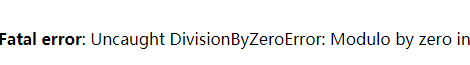
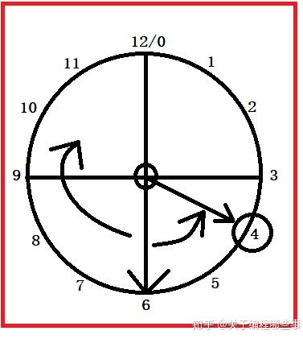
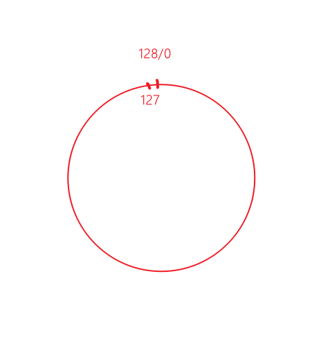

## 操作运算符

### 1 赋值运算

将“=”号右边的运算结果保存到内存中，然后将结果的内存地址保存给左边的变量或常量


### 2算术运算符

+-*/%加减乘除 取余

/和%的被除数不能为0

```php
$b = 1 % 0; // error
```




### 3 比较运算符

```php
// 比较运算符
// == === != !== >= <=
// ==类型可以不同 ===类型也要相同
var_dump(1 > 2); // false
var_dump(1 == "1");  // true
var_dump(1 === "1"); // false
```

### 4 逻辑运算符

### 5 连接运算符

### 6 错误抑制符

```php
<?php
// 逻辑运算符
// && || ! 与或非
$a = true;
$b = false;
var_dump($a && $b);  // false a与b都要true才true
var_dump($a || $b);  // true a或b有一个为true则为true
var_dump(!$a);  // false 取反，非true为false
// 逻辑与和逻辑或被称为短路运算，如果前面的表达式满足条件，后面可能就不会继续执行，所以把出现概率最大的表达式放在前面，提高效率

// 连接运算符
// . 对左右两边做字符串拼接，得到一个新的字符串
$c = '<br>' . $a . $b;
echo $c;
echo gettype($c);
// .= 复合运算，将左边和右边连接起来，再赋值给左边
$a .= $b; //相当于 $a = $a.$b;

echo '<br>';
// 错误抑制符
// @符号
// 在可能出错的表达式前面添加@符号，通常用于生产环境阻止用户看到报错
// echo ($a / 0); // 报错
echo (@$a / 0);  // 不报错
```


### 7 三元运算

```php
// 表达式1?表达式2:表达式3
// 如果表达式1为true，则执行表达2，否则执行表达式3
// 可以嵌套
echo '1>0?';
echo 1 > 0 ? 'yes' : 'no';
```

### 8 自操作运算符

```php
// 自操作运算符
// ++ -- 自增自减，可以前置或者后置
// 需要注意的是，++$a和$a++有一定差异，前置是先自增，再参与其他运算，后置自操作先把自己的值保留一份给别人去参与运算，自己再改变，可以理解为先运算后自操作
$a = 1;
$b = $a++; // a先赋值给b,然后再加1变成2 ，b为1

$a = 1;
$c = ++$a; // a先加1，然后赋值给c， c为2
echo $a, $b, $c;

// 衍生
// += -= *= /= %= 类似自操作，左边与右边先运算，再赋值给左边
```


### 9 位运算符

#### 8.1计算机码

计算机存数据时用二进制规则，计算机码左边第一位是符号位，正数为0，负数为1

- 原码：数据本身从十进制转成二进制
  - 正数 符号位为0
  - 负数 符号位为1
- 反码：正数反码为本身，负数的反码是，符号位不变，其他位取反
- 补码：正数补码是本身，负数的补码是反码+1
- 系统中存在两个0：+0和-0（也就是符号位不同，其他位都是0）

- 为什么要用反码和补码，怎么来的？

  https://zhuanlan.zhihu.com/p/91967268?utm_source=wechat_session

  https://blog.csdn.net/qq_24601199/article/details/78724137

  简单来说，以前为了简化计算机基础电路设计，减法其实是加上一个负数，让符号位参与运算，这样导致结果不对，需要用反码让结果正确。但是又出现+0和-0的问题，于是用补码解决。

- 图形化理解

  把数据想象成表盘，表盘顺时针转为加法（正数），逆时针转为减法（负数），要把6转到4，可以-2也可以+10，也就是说，-2的操作可以用+10代替，同样的，-1也可以用+11代替。

  原码转为反码，也就是把-2转成+10进行计算，从而得到正确结果4。

  

  



补码：为什么负数计算时要 +1转成补码？并且计算结果仍然正确

因为使用反码后，符号位参与运算，导致出现+0和-0两个0，并且有-1+1=-0。为了保持0的唯一性，反码计算时+1。

反码+1的操作，就是扩大了负数表盘的区间。此时上限就是+127，下限就是-128。

还有些不太明白的地方以后详细了解，目前先就酱紫。。。

