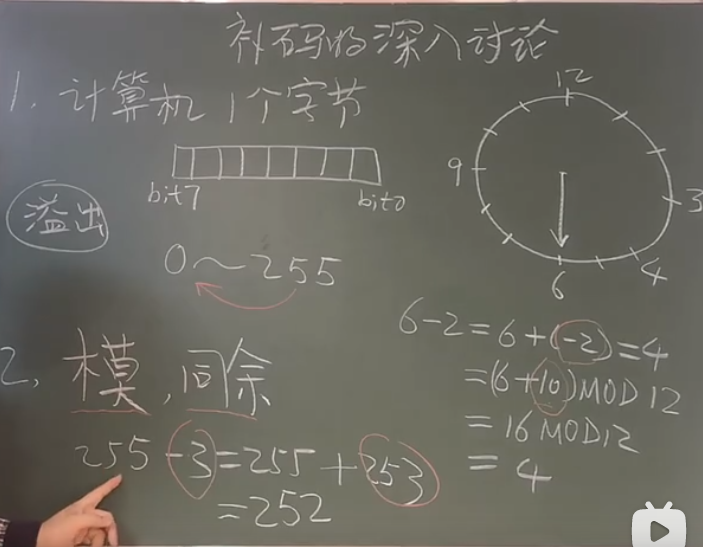
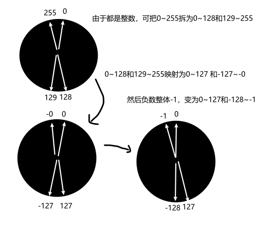
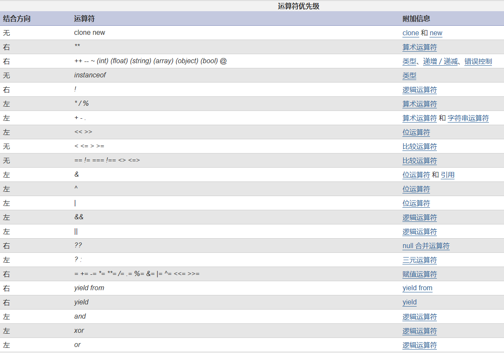

## 操作运算符

### 1 赋值运算

将“=”号右边的运算结果保存到内存中，然后将结果的内存地址保存给左边的变量或常量


### 2算术运算符

+-*/%加减乘除 取余

/和%的被除数不能为0

```php
$b = 1 % 0; // error
```


### 3 比较运算符

```php
// 比较运算符
// == === != !== >= <=
// ==类型可以不同 ===类型也要相同
var_dump(1 > 2); // false
var_dump(1 == "1");  // true
var_dump(1 === "1"); // false
```

### 4 逻辑运算符

### 5 连接运算符

### 6 错误抑制符

```php
<?php
// 逻辑运算符
// && || ! 与或非
$a = true;
$b = false;
var_dump($a && $b);  // false a与b都要true才true
var_dump($a || $b);  // true a或b有一个为true则为true
var_dump(!$a);  // false 取反，非true为false
// 逻辑与和逻辑或被称为短路运算，如果前面的表达式满足条件，后面可能就不会继续执行，所以把出现概率最大的表达式放在前面，提高效率

// 连接运算符
// . 对左右两边做字符串拼接，得到一个新的字符串
$c = '<br>' . $a . $b;
echo $c;
echo gettype($c);
// .= 复合运算，将左边和右边连接起来，再赋值给左边
$a .= $b; //相当于 $a = $a.$b;

echo '<br>';
// 错误抑制符
// @符号
// 在可能出错的表达式前面添加@符号，通常用于生产环境阻止用户看到报错
// echo ($a / 0); // 报错
echo (@$a / 0);  // 不报错
```


### 7 三元运算

```php
// 表达式1?表达式2:表达式3
// 如果表达式1为true，则执行表达2，否则执行表达式3
// 可以嵌套
echo '1>0?';
echo 1 > 0 ? 'yes' : 'no';
```

### 8 自操作运算符

```php
// 自操作运算符
// ++ -- 自增自减，可以前置或者后置
// 需要注意的是，++$a和$a++有一定差异，前置是先自增，再参与其他运算，后置自操作先把自己的值保留一份给别人去参与运算，自己再改变，可以理解为先运算后自操作
$a = 1;
$b = $a++; // a先赋值给b,然后再加1变成2 ，b为1

$a = 1;
$c = ++$a; // a先加1，然后赋值给c， c为2
echo $a, $b, $c;

// 衍生
// += -= *= /= %= 类似自操作，左边与右边先运算，再赋值给左边
```


### 9 位运算符

#### 9.1计算机码

计算机存数据时用二进制规则，计算机码左边第一位是符号位，正数为0，负数为1

- 原码：数据本身从十进制转成二进制
  - 正数 符号位为0
  - 负数 符号位为1
  
- 反码：正数反码为本身，负数的反码是，符号位不变，其他位取反

- 补码：正数补码是本身，负数的补码是反码+1（实际是模-|原码| 模减原码的绝对值，为了方便计算机计算，所以先让他求反码）

-  0的反码和补码都是0000 0000

   -128（-0）补码为1000 0000，他比较特殊，是人为规定的，没有原码和反码（因为原码只能表示+0~127和-0~-127）

  

- 为什么要用反码和补码，怎么来的？

  简单来说，加法电路比减法电路更简单，为了简化计算机基础电路设计，要让减法转换为加法，当舍弃溢出进位时，减去这个数，等于加上这个数的同余数，这个同余数就是补码（模：计数系统的状态数，补码=模-|原码绝对值|）。不过为了方便计算机计算，转换为先求反码再+1）。

> 所谓原码就是机器数，是加了一位符号位的二进制数，正数符号位为0，负数符号位为1，计算机中存储、处理、运算的数据通常是8位、16位、32位或64位的，这里以最简单的8位为例讲解。注意符号位是包含在8位中的其中1位，故可直观读出的数只有7位（只有后7位数可以按权展开）。有心人可能注意到原码是有缺陷的，它只能表示255种状态，因为00000000（＋0）和10000000（－0）其实是一个数，因此原码的表示范围成了－127到＋127，这个问题需要神奇的补码来解决，因为在补码中10000000被用来表示－128。
>
> 所谓反码，英语里又叫ones' complement（对1求补），这里的1，本质上是一个有限位计数系统里所能表示出的最大值，在8位二进制里就是11111111，在1位十进制里就是9，在3位十六进制里就是FFF（再大就要进位了）。求反又被称为对一求补，用最大数减去一个数就能得到它的反，很容易看出在二进制里11111111减去任何数结果都是把这个数按位取反，0变1，1变零，所以才称之为反码。用原码求反码的方法是，正数不变，负数保留符号位1不变，剩下位按位取反。
>
> 所谓补码，英语里又叫two's complement（对2求补），这个2指的是计数系统的容量（模），就是计数系统所能表示的状态数。对1位二进制数来说只有0和1两种状态，所以模是10也就是十进制的2，对7位二进制数来说就是10000000，这个模是不可能取到的，因为位数多一位。用模减去一个数（无符号部分）就能得到这个数的补，比如10000000－1010010=0101110，事实上因为10000000=1111111+1，稍加改变就成了（1111111－1010010）+1，所以又可以表述为先求反再加1。总结求补码的方法就是正数依旧不变，负数保留符号位不变，先求反码再加上1。

https://zhuanlan.zhihu.com/p/91967268?utm_source=wechat_session

https://www.zhihu.com/question/20159860

https://blog.csdn.net/qq_24601199/article/details/78724137

https://www.zhihu.com/question/20159860

视频： https://www.bilibili.com/video/BV1HJ411c7SS



- 涉及到同余，莫有学过。。。

- 图形理解

  把数据想象成表盘，表盘顺时针转为加法，逆时针转为减法，要把6转到4，可以-2也可以+10，也就是说，-2的操作可以用+10代替，同样的，-1也可以用+11代替。

  原码转为反码，也就是把-2转成+10进行计算，从而得到正确结果4。

  


补码：为什么负数计算时要 +1转成补码？并且计算结果仍然正确？

使用反码后，符号位参与运算，导致出现+0和-0两个0。为了保持0的唯一性，负数反码+1变成补码。

负数反码+1。

- 通过下图可以发现，带符号整数与不带符号整数具有一一对应的关系，求带符号数的加法，可以看成求不带符号数的加法。

- 为了避免-0，负数区间整体-1。

  

#### 9.2 位运算符

对计算机中的最小单位bit位进行运算

- &：按位与，两个都为1，结果为1，否则为0
- |：按位或，两个钟有一个为1，结果为1，否则为0
- ~：按位非，一个位，如果为1，结果为0，如果为0，结果为1
- ^：按位异或，两个相同则为0，不同则为1
- <<：按位左移，bit位整体左移一位，右边补0
- \>>：按位右移，bit位整体右移一位，左边补符号位，正数补0，负数补1

```php
<?php
$a = 5;
$b = -5;


var_dump($a & $b);  // 1
/* 
按位与
  首先取出系统存储的数值，然后判断符号位，进行转码

   原码：第一位为符号位，参与运算
   5   -> 0000 0101
   -5  -> 1000 0101

  反码：正数反码不变，负数反码符号位不变，后面按位取反
   5   -> 0000 0101
   -5  -> 1111 1010

  补码：正数补码不变，负数反码+1
   5   -> 0000 0101
   -5  -> 1111 1011

  计算机进行位运算都是采用补码进行运算 ，运算结束后需要转成原码才是要显示的结果
    0000 0101
  & 1111 1011
  = 0000 0001
  结果为1
  */

var_dump(~$a);
echo '<hr>';
/* 
  按位非
  正数反码补码是本身，按位非之后，补码符号位为1，要-1还原为反码，再还原为原码
     0000 0101
  ~  1111 1010
  -1 1111 1001
  =  1000 0110
  结果为-6
  */

var_dump($b << 1);  // -10
var_dump($b << 2);  //-20
var_dump($b << 3);  // -40
var_dump($b << 4);  //-80
echo '<hr>';
/* 
  按位左移1位和2位
  补    1111 1011
  <<1   1111 0110   <<2   1110 1100
  反    1111 0101         1110 1011
  原    1000 1010         1001 0100
  十进制 -8+-2= -10       -16+-4= -20
  */

var_dump($b >> 1);  // -3
var_dump($b >> 2);  // -2
var_dump($b >> 3);  // -1
var_dump($b >> 4);  // -1后面都是-1。为啥？看下面
/*
  按位右移1位
  补    1111 1011
  >>1   1111 1101     >>3 1111 1111    >>4  1111 1111
  反    1111 1100         1111 1110     同
  原    1000 0011         1000 0001
  十进制 -2+-1= -3        -1              -1
  */

  // 按位左移：可以看做补码乘以2
  // 按位右移：类似补码除以2的操作，但不完全正确

  
```


## 10 运算符优先级和结合方向

### 10.1 是啥

- 运算符优先级：指定了两个表达式绑定得有多"紧密"，如1*2+3会先计算1\*2，再算2+3，因为\*比+优先级更高，优先计算出结果

- 结合方向：当运算符优先级相同时，结合方向决定了先从哪边开始计算，如2+3+4，结合方向为左，从左开始，先算2+3，再算5+4。

- **没有结合方向的，相同优先级运算符不能连在一起使用，如：1<2>3**


### 10.2 从高到低优先级

大部分的：

- 一元运算符 》二元运算符 》三元运算符
- 算数运算 》 比较运算  》  位运算  》  逻辑运算  》  赋值运算
- 长得比较像的通常在一起，比如>>和>=，&和&&
- 带有赋值运算的复合运算优先级很低
- 比较运算没有结合方向

几个比较常用的

| 类型     | 运算符                                        | 结合方向 |
| -------- | --------------------------------------------- | -------- |
| 自增自减 | ++ --                                         | **右**   |
| 逻辑运算 | ！                                            | **右**   |
| 算数运算 | */%  高于  +-                                 | 左       |
| 位运算   | \>> <<                                        | 左       |
| 比较运算 | <  <=  >  >=  高于  ==  !=  ===  !==  <>  <=> | ***无*** |
| 位运算   | & 高于 ^ 高于  \|                             | 左       |
| 逻辑运算 | &&  高于  \|\| 高于                           | 左       |
| 三元运算 | ? :                                           | 左       |
| 赋值运算 | =  += -= *= **= /= .= %= &= \= ^= <<= >>=     | **右**   |





需要加快速度了，笔记改为php里面注释记，不单独记了。