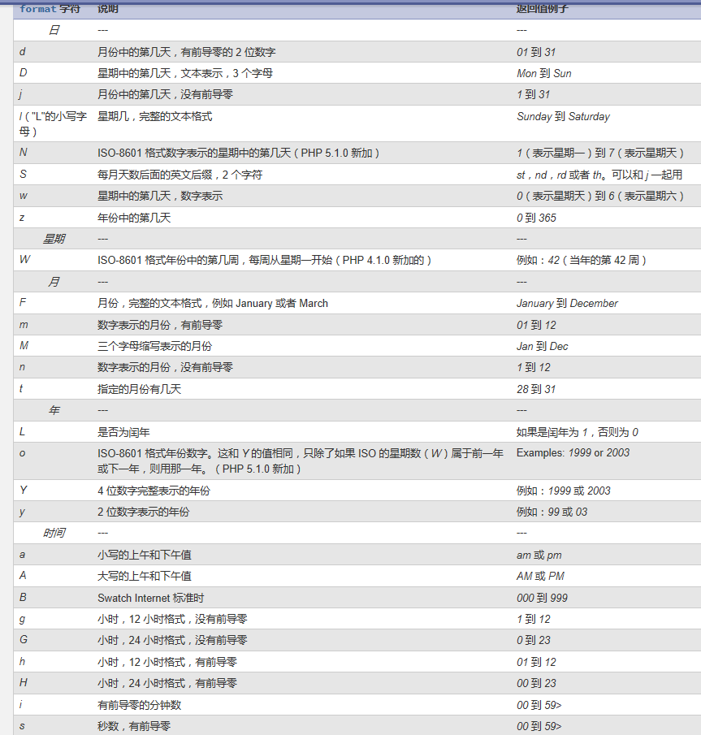

## 1 文件包含

https://blog.csdn.net/qq_36324472/article/details/110133609

### 1.1 是啥

在一个php脚本文件中包含另一个php文件

### 1.2 有啥用

- 向上包含（把朋友的东西给自己用）：使用被包含文件中的内容，比如变量、函数等等，实现代码复用，一般在上面引用，叫向上包含

- 向下包含（把自己的东西给朋友用）：将自己的变量函数等等，分析给被包含的文件，，一般在下面引用，叫向下包含
- 分工协作，利于维护和阅读


### 1.3 怎么用

包含两大种，4小种

- include 
- include_once
- require
- require_once


带有once的，系统会自动判断是否已经包含过，不重复包含

```php
<?php
// 向上包含，使用上面包含文件中的内容
  include '1-aa.php';
  // 另一种写法
  // include(文件路径)
  echo $a;
$b = 2;
  // 向下包含，先把自己的内容给下面包含的文件使用
  require '1-bb.php';
  

  

  // include和require区别
  // include包含文件出错，错误级别为Warning，不影响后面继续执行
  include '1-cc.php';
  // require包含文件出错，错误级别为error，后面代码不会执行
  require '1-cc.php';

  // 不过我这个都是报的warning，可能是新版本或者配置不同导致的


```


#### 文件加载原理：

系统将被包含内容嵌入到包含关键字所在位置，类似于复制过来了（魔术常量例外，仍然是原来文件的信息）
但是和直接写一起有区别：被包含文件单独编译，加载到内存中

#### php代码执行过程：

- 读取php文件 

- php编译为字节码(opcode） 

- zend engine解析opcode，按照字节码进行逻辑运算 

- 转换为html代码


## 2 函数

### 2.1 是什么

函数function时一种语法结构，将实现某个功能的代码块封装到一个结构中，从而实现代码复用

### 2.1 作用

代码复用,一般一个功能一个函数，

### 2.2 语法

```php
function 函数名([参数]){
	函数体
    [return 返回值]
}
```

### 2.3 注意

```php
<?php
// 1.如果函数定义时有形参，那么调用时需要传实参
function aaa($a)
{

  echo $a;
  return __FUNCTION__; // 魔术常量，返回当前函数名
  echo 'return关键字除了返回值，还表示函数运行结束，下面的代码不会执行';
}
// 2.如果函数体（花括号中间这部分）定义了返回值，那么外面可以接收到，如果没有返回值，系统默认返回NULL
$b = aaa(1);

var_dump(aaa(1)); // 如果没有写返回值，默认返回NULL

echo $b;


  // 3.函数执行是在代码执行阶段，执行到函数调用的那一行才去内存中进行调用，不是在编译阶段，所以可以在函数定义之前写调用代码（因为已经编译好了）
```

### 2.4.函数命名规范


- 驼峰法  showInfo

- 下划线法 show_info

- 命名要有具体意义，尽量看名字就大概知道这个函数的功能，不要乱写，比如showInfo不要写成si等意义不明的东东

- 一个脚本周期中不能有两个同名函数


### 2.5 关于参数

- 作用：1.使用外部变量 2.动态地执行函数，根据不同参数，得到不同结果

- 形参：在函数定义时，并没有实际参数，所以用形参代替实参，在执行时用于接收实参
- 实参：函数执行时，实际参与运算的参数，运算之前系统会把实参赋值给形参
- 形参数量要小于等于实参，如果定义时有3个形参，但是执行只传了2个实参，会报错（没有默认值的情况下），但是实参数量可以大于形参，多出的实参不会导致报错

- 默认值：定义函数时给形参设置默认值，如果没有传对应的实参，那么会用默认值代替（一般用于实参值很大可能是这个，但是又可能会变化的情况）

### 2.6 执行过程

- 系统调用函数时，先去内存寻找是否有这个函数

- 系统在栈区开辟内存空间运行函数

- 先查看函数是否有形参

* 在判断调用时是否传了对应的实参

- 默认将实参赋值给形参

* 执行函数体

* 将函数返回值返回出去（如果有返回的话）

  

```php
// 多个参数
// 这里有2个形参
function addition($a, $b)
{
  return $a + $b;
}
// 只有传了1个实参，第二个实参没有实际值，导致报错
// echo addition(1);
// 这里有3个实参，第三个虽然没有形参接收，但此时有没有这个多余的参数都不会导致函数体出错
echo addition(1, 2, 3);
echo '<br>';

// 默认值
// 定义时就给形参初始值，调用时如果不传入，就会使用初始值，如果传实参，则会覆盖初始值
// 注意：默认值必须放在最右边，不能左边有右边没有，错误案例：function subtraction($a=1, $b)
function subtraction($a=1, $b=2)
{
  return $a - $b;
}

echo subtraction(2);
```

### 2.7 引用传递

通常情况，实参赋值给形参是简单值传递，即将实参的值复制一份，然后将复制的值赋值给形参，改变形参并不会影响实参

如果希望函数内部修改形参可以影响到实参，就可以用 ``&$变量名``，将实参的内存地址赋值给形参，二者会指向相同的内存地址，从而互相影响

- 引用传递时，&符后面必须是变量（不能是常量等）

### 2.8 函数体、return

{}之间的内容就是函数体，可以进行各种操作

通过return关键字给出返回值，将他返回到函数调用的位置

- return表示函数结束，后面的代码不会执行

- return在被包含文件中使用，可以将某些东东返回给声明文件包含的位置，同时被包含文件终止执行

### 2.9 作用域

作用域：变量、常量能够被访问的区域，能够起作用的区域

一般每个函数都有自己独立的局部作用域

- 全局变量：在最外面，用普通方式定义的变量，所属全局空间，php中只允许在全局空间使用，一般函数内部不可以访问，生命周期为脚本周期（脚本执行完才销毁）

- 局部变量：在函数体内定义的变量，默认作用域就是当前函数，只有当前函数内可以使用，函数外部无法访问，生命周期为函数周期（函数执行完就销毁，可以特别处理后保留）
- 超全局变量：系统定义的变量（预定义变量$\_SERVER $\_POST等）没有访问限制，哪里都可以用


### 2.10 global关键字

如果要让局部和全局都可以访问某个变量，除了使用超全局变量，以及参数引用传值之外，还可以通过global关键字

global关键字可以在函数内部声明变量，此变量如果在函数外有全局同名变量，则自动指向全局变量，如果没有同名的，则在外部自动声明一个同名全局变量，并且内外两个变量都是指向同一个内存空间。本质就是声明全局和局部同名变量，并且保存相同内存地址。

语法：global 变量名; 

- global声明时不能赋值

```php
$g = 1;
function g()
{
  global $g;
  $g = 3; // 这里修改g,外面也被修改了
  global $g2; //外面没有g2，自动声明一个全局g2
  $g2 = 2;
}
g();
echo $g;
echo '<br>';
echo $g2;

  // 一般不会这么用，而是用参数形式，或者常量（常量没有访问限制）
```


### 2.11 static静态变量

- 静态变量（static）：仅在在函数作用域内存在，当程序执行到离开作用域后，静态变量没有销毁，之后再进入该函数作用域时，可以继续使用上次执行后保留的值。
- 一般用于函数执行次数的统计，以及递归时，根据递归次数，执行不同代码。

```php
function count1()
{
  $i1 = 0;  // 普通局部变量，函数执行完销毁，相当于每次重新赋值为0
  echo $i1++;
  echo '-';
  static $i2 = 0;  // static静态变量，函数执行完没销毁，下次执行不会重新赋值，而是使用上次的值
  echo $i2++;
  echo '<br>';
}

echo '<hr>';
count1();
count1();
count1();
```

- 系统编译时就对static变量初始化赋值了，函数调用时，自动跳过static这一行，没有重新赋值

### 2.12 可变函数

类似可变变量，使用变量保存函数的名字，然后$变量();调用对应的函数。一般在回调函数里面用的比较多。

### 2.13 回调函数

可变函数一般用于回调函数，意思是函数执行到某一步，再去调用另外的函数，并且这个函数是作为参数传进去的

```php
// 可变函数

function add()
{
  echo 1 + 2;
}
// 用变量保存函数的名字
$myFunc = 'add';
// 然后调用
$myFunc();
echo '<hr>';


// 回调函数
// 一个函数内调用另一个函数，并且这个函数是通过参数传进来的可变函数。
function callBack($func1, $func2)
{
  // 使用callBack时，自动调用传进来的函数，由于代码顺序执行，当回调函数放在最前面或者最后时，就可以通过回调函数是否执行，判断外部函数执行到哪一行了。
  $a = $func1(); // func1一定会在func2前面执行，并且我们可以得到他的返回值，交给第二个回调函数去处理
  // 另外，定义时如果将局部变量传递给可变函数，那么回调函数内部就可以使用这个外部函数的变量了，从而对函数结果进行自定义的处理
  $b = 1;
  $result = $func2($a, $b);
  return $result;  // 返回结果
}
function start()
{
  echo '开始执行了<hr>';
  return 3;  // 返回3，交给回调函数处理
}
// 需要形参接收回调函数传过来的实参
function ended($a, $b)
{
  echo '结束执行了<hr>';
  return $a + $b;
}
$start = 'start';
$ended = 'ended';

// 传变量名进去，或者变量名保存给变量再传，或者用变量保存匿名函数，然后传变量也行
echo callBack('start','ended');
// echo callBack($start, $ended);
```

### 2.14 匿名函数、闭包

```php
<?php
// https://www.php.cn/php-ask-429876.html
// php闭包和js闭包有一些区别

// 匿名函数Anonymous functions：没有名字的函数，定义时要赋值给变量再去使用
$func = function () {
  echo '我是匿名函数<br>';
};  // 由于是赋值，所以结尾要分号

// 用可变函数调用匿名函数
$func();

// 变量保存匿名函数，本质得到一个Closure对象 （闭包对象）
var_dump($func);  // object(Closure)#1 (0) { }
echo '<br>';

/**
 * 匿名函数也叫闭包函数，当匿名函数赋值给变量时，php自动将表达式转换为closure类的实例对象
 * 作用：闭包可以保存上下文的一些变量和值，延长其生命周期
 * 特性：默认闭包不能从父作用域继承变量，一般通过use结构传递进去，默认是传clone的值，如果要完全引用，可以加&进行引用传值
 * 闭包一般理解：函数内部定义匿名函数，然后通过use关键字得到父作用域的变量，接着将匿名函数返回出去。当调用外部函数时，匿名函数被返回，虽然外部函数已经执行结束，但由于匿名函数等待调用，所以use的变量不会销毁。
 */
function out()
{
  $a = 123;
  // 通过use，将父级作用域的变量传入匿名函数内
  $closure = function () use ($a) {
    return $a;
  };
  // 将匿名函数返回出去
  return $closure;
}
// 将返回的匿名函数保存给变量，out虽然执行结束，但$a在等待匿名函数调用，没有销毁
$b = out();
echo $b();
```


### 2.15 伪类型

Mixed混合类型、Number数值类型，主要用于辅助查看操作手册，实际没有这种类型


## 3 系统常用函数

### 3.1 输出

- **print** 类似于echo，输出提供的内容，输出 `arg`。   

  print 实际上不是函数（而是语言结构），所以可以不用圆括号包围参数列表。   

  和 *echo* 最主要的区别：    *print* 仅支持一个参数，并总是返回 1。 

- **print_r** — 以易于理解的格式打印变量。     

```php
// 输出相关
print('print:输出字符串');
echo '<br>';
echo print 'print本质是结构，可以不带括号，返回值为1。<br>';
echo '<br>';
print_r('print_r:以人类易读的格式显示一个变量的信息。 ');
echo '<hr>';
```


### 3.2 时间

- **date()** 返回格式化后的时间，默认当前时间



- **time()** 返回unix时间戳
- **microtime()** 返回微秒数
- **strtotime()** 尝试将时间字符串转为时间戳，失败返回false，默认相对当前时间。

```php
// 时间相关
// 1.按指定格式，输出时间戳（从1970年格林威治时间开始计算的秒数）如果不指定时间，则默认当前时间戳。
// date( string $format[, int $timestamp] ) : string
echo date('Y 年 m 月 d 日 H:i:s');
echo '<br>';

// 2.time()  获取当前时间对应的时间戳
echo time();
echo '<br>';

// 3.microtime()  返回当前unix时间戳和微秒数
// microtime([ bool $get_as_float] ) : mixed
//   如果调用时不带可选参数，本函数以 "msec sec" 的格式返回一个字符串，其中 sec 是自 Unix 纪元（0:00:00 January 1,1970 GMT）起到现在的秒数，msec 是微秒部分。字符串的两部分都是以秒为单位返回的。 
// 如果给出了 get_as_float 参数并且其值等价于 TRUE，microtime() 将返回一个浮点数。 

echo microtime();
echo '<hr>';

// 4. strtotime()
// 本函数预期接受一个包含美国英语日期格式的字符串并尝试将其解析为 Unix 时间戳（自 January 1 1970 00:00:00 GMT 起的秒数），其值相对于 now 参数给出的时间，如果没有提供此参数则用系统当前时间。 
// strtotime( string $time[, int $now = time()] ) : int
echo strtotime('10 hours'); // 返回当前时间10小时之后的时间戳
echo '<hr>';
```


### 3.3 数学

- max 返回参数中的最大值
- min 返回参数中最小值
- rand 得到指定区间的随机数
- mt_rand 也是随机数，不过效率比rand高
- round 四舍五入
- ceil 向上取整
- floor 向下取整
- pow 求指数幂：pow(2,8)即求2^8
- abs 求绝对值
- sqrt 求平方根

### 3.4 函数处理

- function_exists 判断指定函数是否在内存中存在，帮助用户不去使用不存在的函数（语言结构不会返回true）
- func_get_arg 从用户自定义函数的参数列表中获取某个指定的参数。 
- func_get_args 返回一个包含函数参数列表的数组
- func_num_args 返回传递给函数的参数数量

```php
// 函数相关
function add($a, $b)
{
  // 返回传入函数的参数中的某一个
  echo func_get_arg(1) . '<br>';  // 返回2
  // 以数组形式，返回传入函数的所有参数
  var_dump(func_get_args());  // 返回[1,2,3]
  echo '<br>';
  // 返回传入函数的参数数量
  echo func_num_args() . '<br>';  // 返回3
  return $a + $b;
}


// 判断函数内存中是否存在
var_dump(function_exists('add'));
echo '<br>';
// 利用短路运算，如果函数存在才执行
function_exists('add') && add(1, 2, 3);
```

