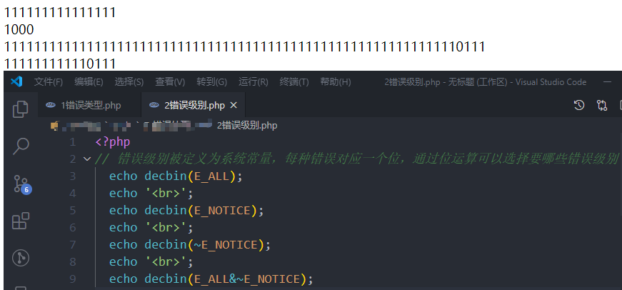

#  错误处理

代码执行时发现了错误，通过错误处理形式告知程序员

## 1 错误分类

- 语法错误parse error
  - 代码书写不符合php语法，编译时不通过
- 运行时错误runtime error
  - 代码语法正确，但是运行时缺少某些条件，比如变量
- 逻辑错误
  - 写代码时 出现逻辑性错误，代码正常执行，但结果不符合预期，比如++$a写成$a++导致结果不同，以及等于判断==写成赋值符号=

## 2 错误级别level

错误代码在php中被定义为系统常量

### 2.1系统错误

- E_PARSE： 编译错误，语法错误
- E_ERROR： fatal error 致命错误 会在出错位置停止运行
- E_WARNING： 警告错误，不影响继续执行，但可能得不到预期结果

- E_NOTICE ：通知错误，仅通知一下，不影响执行

### 2.2 用户错误

表示自定义的错误、警告、通知

- E_USER_ERROR
- E_USER_WARNING
- E_USER_NOTICE

### 2.3 其他

- E_ALL 所有错误的集合

### 2.4 补充

所有以E开头的错误常量，由一个字节存储，每种错误对应一个bit位，可以使用位运算进行错误控制

例如：排除通知级错误   E_ALL & ~E_NOTICE     对E_NOTICE按位取反，让他对应的位为0，然后和E_ALL按位与，



`

## 3 错误触发

自动触发：主要针对语法错误和运行时错误，系统自动输出错误信息

人为触发：知道这个地方可能出现逻辑错误，在出错之前，用判断代码来手动触发错误提示

**trigger_error**    ( string `$error_msg`   [, int `$error_type` = E_USER_NOTICE  ] ) : bool

```php
// 题外话 设置header
header('content-type:text/html;charset=utf8');

// 语法错误和运行错误会自动触发
// 如果要手动触发用户定义的错误，可以这么做

// 假设有一个除法函数，我们要对第二个参数进行检验，如果为0，就触发错误，并结束执行，默认为notice级别，可修改
function divide($a, $b)
{
  if ($b == 0) {
    // trigger_error('除数不能为0', E_USER_ERROR);
    trigger_error('除数不能为0');
    return false;
  }
  return $a / $b;
}
// 没报错
echo divide(1,2);

// 报错
echo divide(1,0);

// 由于默认是notice错误，所以不影响后面执行
echo divide(1,1);
```


## 4 错误设置

 设置是否显示错误，以及显示什么级别的错误


方式一：

 打开php.ini全局配置文件，修改以下两项

 display_errors: On/Off

 error_reporting: 错误级别


方式二：

 在php脚本中，使用php的相关函数设置

 error_reporting() 设置显示的错误级别


 ini_set(配置项,配置值);  修改配置

 exempli gratia（例如 eg）

 ini_set('display_errors',1);

 ini_set('error_reporting',E_ALL);


 注意：脚本中的配置修改比配置文件级别更高


## 5 设置错误日志

生产环境中，一般会关闭错误信息提示，但又需要记录偶尔的报错，可以到php.ini中配置错误日志功能

- 开启日志 log_errors = On 
- 指定日志路径 error_log = e:/php/errlog/php_errors.log

## 6 自定义错误处理

```php
<pre>
1 最简单的错误处理：trigger_error()函数，但不会阻止系统报错
2 php提供了一种用户处理错误的机制，将自定义的错误处理函数添加到系统错误处理句柄中，发生错误时回调该函数进行对应处理
  set_error_handler用法： 
  set_error_handler( callable $error_handler[, int $error_types = E_ALL | E_STRICT] ) : mixed
  参数一：$error_handler  传入的回调函数有五个实参可接收
  handler( int $errno, string $errstr[, string $errfile[, int $errline[, array $errcontext]]] ) : bool
  $errno 错误级别 是一个integer类型  必须参数
  $errstr 错误信息 string类型   必须参数
  $errfile 错误的文件 
  $errline 错误的行数
  $errcontext 包含错误所处作用域内所有变量的数组array php7.2.0后被废除，不推荐使用

  参数二：$error_types
  指定错误类型掩码，可以屏蔽某些错误触发error_handler

  如果函数返回 FALSE，标准错误处理处理程序将会继续调用。 返回true则不会继续调用标准错误处理程序。

  题外话：句柄是啥？
  句柄：handle，有操作控制之意，是一种中间媒介，在代码中，则是一种数字标记，通过句柄可以访问与之对应的对象，类似于指针，但是不会暴露该对象真实地址
  例子：你要找李华，让他帮你买一包薯片，指针就是李华此时的所在地，句柄就是李华的手机号，李华可能在超市买东西，也可能在街上溜达，所以你很难知道他此时具体在哪，不过你可以给他打电话，通过无线电建立了一个快速通道，直接把要做的事情告诉李华。

  “句柄（handle），有两种解释
  第一种解释：句柄是一种特殊的智能指针 。当一个应用程序要引用其他系统（如数据库、操作系统）所管理的内存块或对象时，就要使用句柄。
  第二种解释：整个Windows编程的基础。
  句柄是Windows用来标识被应用程序所建立或使用的对象的唯一整数，WINDOWS使用各种各样的句柄标识诸如应用程序实例，窗口，控制，位图，GDI对象等等。”

  https://www.php.cn/faq/418211.html
  https://www.zhihu.com/question/27656256
  https://blog.csdn.net/qq_39618306/article/details/78996840
  指针和句柄的区别：https://blog.csdn.net/yipiankongbai/article/details/17404247
  句柄是指针的指针，由于所管理对象的内存地址会发生改变，为了更好管理他们，就用句柄作为中介。使用时不需要关心对象实际所在地址，只要根据句柄来找中介，通过中介访问对象。
  

</pre>


<?php
function errHandler($errno, $errstr, $errfile, $errline)
{
  // 判断错误是否属于系统配置中所要显示的错误级别
  // error_reporting()没有参数，表示获取系统错误处理对应级别
  if (!(error_reporting() & $errno)) {
    return false;  //  返回false，表示继续调用标准错误处理程序
  }
  // 根据不同类型进行处理
  switch ($errno) {
    case E_ERROR:
    case E_USER_ERROR:
      echo 'fatal error in file' . $errfile . 'on line' . $errline.'<br>';
      echo 'error info:' . $errstr;
      break;
    case E_WARNING:
    case E_USER_WARNING:
      echo 'warning in file' . $errfile . 'on line' . $errline.'<br>';
      echo 'error info:' . $errstr;
      break;
    case E_NOTICE:
    case E_USER_NOTICE:
      echo 'notice in file' . $errfile . 'on line' . $errline.'<br>';
      echo 'error info:' . $errstr;
      break;
  }
  return true;  //  返回true 表示阻止系统标准错误处理程序执行
}

echo $a;  // 标准的错误处理

// 将自定义错误处理函数添加到系统错误处理句柄中
set_error_handler('errHandler');

echo $a;  // 自定义的错误处理

```

