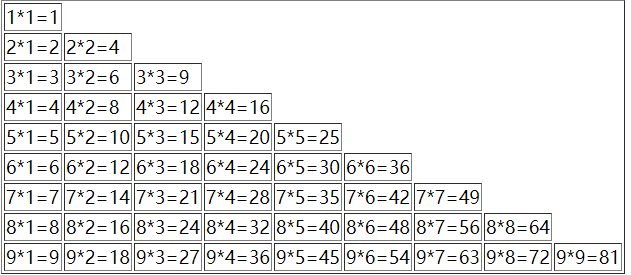

## 流程控制

和js差不多

### 1 顺序结构

默认从上往下执行

### 2 条件结构

if elseif else

switch

### 3 循环结构

#### 3.1 for

```php
// 基本用法
// 第一个表达式：初始化条件，可以有多个语句，用逗号分隔，在第一次循环开始前执行
// 第二个表达式：边界判断，用于终止循环，在每次循环开始前执行
// 第三个表达式：改变循环变量，在每次循环结束后执行
for ($i = 0; $i < 10; $i++) {
  echo $i;
}

// 特殊用法
$ii=1;
// 省略for后面的表达式，会无条件执行代码块
for(;;){
  // 在代码块里面手动进行初始化、边界判断、改变变量，否则会死循环
  echo $ii++;
  if($ii>10){
    break;  // 终止循环
  }
}

// 边界条件有时需要动态获取，所以把他用变量表示，同时初始化时获取到值，以免重复获取
// 假设这里10是动态的无法预先知道多少，初始化时赋值，只需要执行一次，如果判断时获取。每次都要去获取
for ($i = 0, $end = 10; $i < $end; $i++) {
  echo $i;
}
```


#### 3.2 while

```php
// 先判断条件，再决定是否执行
$b = 1;
while ($b < 10) {
  echo $b;
  // 必须要改变循环的变量，否则会死循环，卡住
  $b++;
}
```


#### 3.3 do while

```php
//和while差不多，但是会先执行一次，在判断条件，至少执行一次
$c = 1;
do {
  echo $c;
  $c++;
} while ($c < 10);
```

### 4 流程控制替代语法

php中经常嵌套html使用，由于还要嵌套for、if等等，有很多"{"和"}"，导致阅读不方便，容易搞混
所以出了一种替代语法，{用:冒号代替，}用endxxx代替，xxx指的流程控制关键字比如endfor endif 等

```php
<table border="1">
  <!-- 第一次for是普通写法 -->
  <?php for ($i = 1; $i < 10; $i++) { ?>
    <tr>
      <!-- 第二次for使用替代语法 -->
      <?php for ($j = 1; $j <= $i; $j++) : ?>
        <td>
          <?php echo $i . '*' . $j . '=' . $i * $j ?>
        </td>
      <?php endfor ?>
    </tr>
  <?php } ?>
</table>
```



